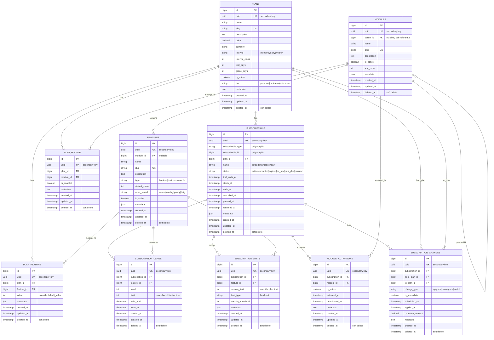

```mermaid
erDiagram
    %% Core Subscription Tables
    PLANS {
        bigint id PK
        uuid uuid UK "secondary key"
        string name
        string slug UK
        text description
        decimal price
        string currency
        string interval "monthly|yearly|weekly"
        int interval_count
        int trial_days
        int grace_days
        boolean is_active
        string tier "personal|business|enterprise"
        json metadata
        timestamp created_at
        timestamp updated_at
        timestamp deleted_at "soft delete"
    }
    
    FEATURES {
        bigint id PK
        uuid uuid UK "secondary key"
        bigint module_id FK "nullable"
        string name
        string slug UK
        text description
        string type "boolean|limit|consumable"
        int default_value
        string reset_period "never|monthly|yearly|daily"
        boolean is_active
        json metadata
        timestamp created_at
        timestamp updated_at
        timestamp deleted_at "soft delete"
    }
    
    MODULES {
        bigint id PK
        uuid uuid UK "secondary key"
        bigint parent_id FK "nullable, self-referential"
        string name
        string slug UK
        text description
        boolean is_active
        int sort_order
        json metadata
        timestamp created_at
        timestamp updated_at
        timestamp deleted_at "soft delete"
    }
    
    PLAN_FEATURE {
        bigint id PK
        uuid uuid UK "secondary key"
        bigint plan_id FK
        bigint feature_id FK
        int value "override default_value"
        json metadata
        timestamp created_at
        timestamp updated_at
        timestamp deleted_at "soft delete"
    }
    
    PLAN_MODULE {
        bigint id PK
        uuid uuid UK "secondary key"
        bigint plan_id FK
        bigint module_id FK
        boolean is_enabled
        json metadata
        timestamp created_at
        timestamp updated_at
        timestamp deleted_at "soft delete"
    }
    
    SUBSCRIPTIONS {
        bigint id PK
        uuid uuid UK "secondary key"
        string subscribable_type "polymorphic"
        bigint subscribable_id "polymorphic"
        bigint plan_id FK
        string name "default|main|secondary"
        string status "active|cancelled|expired|on_trial|past_due|paused"
        timestamp trial_ends_at
        timestamp starts_at
        timestamp ends_at
        timestamp cancelled_at
        timestamp paused_at
        timestamp resumed_at
        json metadata
        timestamp created_at
        timestamp updated_at
        timestamp deleted_at "soft delete"
    }
    
    SUBSCRIPTION_USAGE {
        bigint id PK
        uuid uuid UK "secondary key"
        bigint subscription_id FK
        bigint feature_id FK
        int used
        int limit "snapshot of limit at time"
        timestamp valid_until
        timestamp reset_at
        timestamp created_at
        timestamp updated_at
        timestamp deleted_at "soft delete"
    }
    
    SUBSCRIPTION_LIMITS {
        bigint id PK
        uuid uuid UK "secondary key"
        bigint subscription_id FK
        bigint feature_id FK
        int custom_limit "override plan limit"
        string limit_type "hard|soft"
        int warning_threshold
        json metadata
        timestamp created_at
        timestamp updated_at
        timestamp deleted_at "soft delete"
    }
    
    MODULE_ACTIVATIONS {
        bigint id PK
        uuid uuid UK "secondary key"
        bigint subscription_id FK
        bigint module_id FK
        boolean is_active
        timestamp activated_at
        timestamp deactivated_at
        json metadata
        timestamp created_at
        timestamp updated_at
        timestamp deleted_at "soft delete"
    }
    
    SUBSCRIPTION_CHANGES {
        bigint id PK
        uuid uuid UK "secondary key"
        bigint subscription_id FK
        bigint from_plan_id FK
        bigint to_plan_id FK
        string change_type "upgrade|downgrade|switch"
        boolean is_immediate
        timestamp scheduled_for
        timestamp applied_at
        decimal proration_amount
        json metadata
        timestamp created_at
        timestamp deleted_at "soft delete"
    }
    
    %% Module Hierarchy (Self-Referential)
    MODULES ||--o{ MODULES : "parent-child"
    
    %% Plan Relationships
    PLANS ||--o{ PLAN_FEATURE : "has"
    PLANS ||--o{ PLAN_MODULE : "has"
    FEATURES ||--o{ PLAN_FEATURE : "belongs_to"
    MODULES ||--o{ PLAN_MODULE : "belongs_to"
    
    %% Feature-Module Relationship
    MODULES ||--o{ FEATURES : "contains"
    
    %% Subscription Relationships
    PLANS ||--o{ SUBSCRIPTIONS : "has"
    
    SUBSCRIPTIONS ||--o{ SUBSCRIPTION_USAGE : "tracks"
    FEATURES ||--o{ SUBSCRIPTION_USAGE : "measures"
    
    SUBSCRIPTIONS ||--o{ SUBSCRIPTION_LIMITS : "defines"
    FEATURES ||--o{ SUBSCRIPTION_LIMITS : "applies_to"
    
    SUBSCRIPTIONS ||--o{ MODULE_ACTIVATIONS : "activates"
    MODULES ||--o{ MODULE_ACTIVATIONS : "activated_in"
    
    SUBSCRIPTIONS ||--o{ SUBSCRIPTION_CHANGES : "logs"
    PLANS ||--o{ SUBSCRIPTION_CHANGES : "from_plan"
    PLANS ||--o{ SUBSCRIPTION_CHANGES : "to_plan"
```
